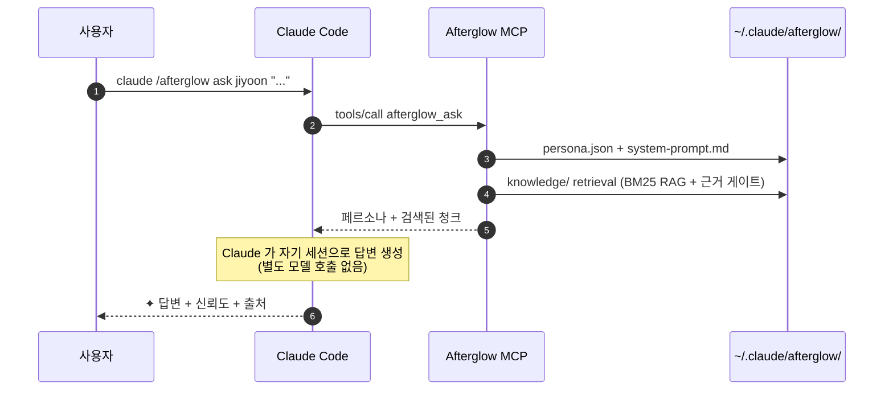

<div align="center">

# `@daeseoksong/afterglow-mcp`

**퇴사한 동료를 에이전트로 만들어서 퇴사 후 인수인계를 수월하게 하세요**

<p>
  <a href="./README.md"></a>
  
</p>

<p>
  <a href="https://www.npmjs.com/package/@daeseoksong/afterglow-mcp"></a>
  <a href="https://www.npmjs.com/package/@daeseoksong/afterglow-mcp"></a>
  <a href="./LICENSE"></a>
  <a href="https://nodejs.org/"></a>
  
  <a href="https://modelcontextprotocol.io"></a>
  <a href="https://github.com/DaeSeokSong/Afterglow"></a>
  <a href="https://github.com/DaeSeokSong/Afterglow/commits/main"></a>
</p>

<p>
  <a href="#-한-줄-설치"><b>한 줄 설치</b></a> ·
  <a href="#-동작-원리">동작 원리</a> ·
  <a href="#-도구-8개">도구 8개</a> ·
  <a href="#-추가-인터뷰--미디어-첨부">추가 인터뷰</a> ·
  <a href="#-핫플러그--exportimport">핫플러그</a> ·
  <a href="#-폴더-구조">폴더 구조</a> ·
  <a href="#-development">개발</a> ·
  <a href="https://github.com/DaeSeokSong/Afterglow">GitHub →</a>
</p>

</div>

---

```
claude /afterglow ask jiyoon "온보딩 step 3 이탈, 어떻게 줄였어요?"

✦ step 3 이탈은 사실 step 3 잘못이 아니었어요. step 2 설명을 절반으로
  줄였더니 이탈이 22% → 9%로 떨어졌어요.
                                                       — 이지윤 · 신뢰도 91%
  ↗ Confluence · DESIGN/onboarding-v2-postmortem
  ↗ ./materials/interview-2025-11-10.pdf · p. 14
```

> 퇴사한 사람의 메시지·문서·코드·인터뷰 자료를 한 폴더에 모아두면, Claude Code 안에서 그 사람의 톤과 지식으로 답하는 페르소나 에이전트가 됩니다. **모델 학습은 없습니다** — 페르소나 + RAG만으로 Claude의 컨텍스트에 주입해요.

## ✦ 한 줄 설치

```bash
claude mcp add afterglow npx -y @daeseoksong/afterglow-mcp
```

별도 GPU · 임베딩 API · 외부 서버 필요 없음. **무료**.

<a href="cursor://anysphere.cursor-deeplink/mcp/install?name=afterglow&config=eyJjb21tYW5kIjoibnB4IiwiYXJncyI6WyIteSIsIkBkYWVzZW9rc29uZy9hZnRlcmdsb3ctbWNwIl19"></a>

<details>
<summary><b>다른 MCP 클라이언트에 설치</b> (Claude Desktop · Cursor · VS Code · Windsurf · Codex · Gemini CLI)</summary>

모든 클라이언트가 이해하는 표준 설정:

```json
{
  "mcpServers": {
    "afterglow": {
      "command": "npx",
      "args": ["-y", "@daeseoksong/afterglow-mcp"]
    }
  }
}
```

**Claude Desktop** — 위 블록을 `claude_desktop_config.json` 에 추가 (설정 → Developer → Edit Config).

**Cursor** — 위 원클릭 배지를 누르거나, `~/.cursor/mcp.json` (프로젝트별로는 `.cursor/mcp.json`)에 추가.

**VS Code** —
```bash
code --add-mcp '{"name":"afterglow","command":"npx","args":["-y","@daeseoksong/afterglow-mcp"]}'
```
또는 `.vscode/mcp.json` 의 `"servers"` 키에 추가.

**Windsurf** — `~/.codeium/windsurf/mcp_config.json` 에 위 블록 추가.

**Codex CLI** — `~/.codex/config.toml` 에:
```toml
[mcp_servers.afterglow]
command = "npx"
args = ["-y", "@daeseoksong/afterglow-mcp"]
```

**Gemini CLI** — `~/.gemini/settings.json` 에 위 블록 추가.

**표면 줄이기 (선택)** — 설정에 `"env": {"AFTERGLOW_TOOLSETS": "core"}` (또는 args 에 `--toolsets core`)를 추가하면 핵심 4개(`guide` · `create` · `learn` · `ask`)만 노출됩니다. 도구가 적을수록 모델의 tool choice 가 정확해지고 컨텍스트도 가벼워져요. 언제든 `all` 로 복귀.

</details>

> `npx @daeseoksong/afterglow-mcp --help` 로 사용법, `--version` 으로 버전 확인 (인자 없이 실행하면 stdio 서버 — 클라이언트가 실행하는 모드).

이어서 첫 사용 — **3단계, init 불필요**:

```bash
claude /afterglow guide                                              # (선택) 뭐부터 하지? — 상태별 안내
claude /afterglow create jiyoon --name 이지윤 --role "프로덕트 디자이너" --signer "이지윤"   # 자동 init + 활성화
claude /afterglow learn  jiyoon --text "<붙여넣기>"   # 또는 --path ./notes/  또는 --url https://…
claude /afterglow ask    jiyoon "온보딩 step 3 이탈, 어떻게 줄였어요?"
```

> **참고 — 두 가지 호출 방식.** Afterglow 는 MCP 서버라 도구는 실제로 `afterglow_interview({slug: "jiyoon", action: "handoff-start"})` 같은 JSON 호출입니다.
> 1. **자연어**: "지윤님 에이전트 만들어줘" → Claude 가 알맞은 도구 호출.
> 2. **슬래시 명령**: Claude Code 입력창에서 **`/mcp__afterglow__<이름>`** (예: `/mcp__afterglow__create`) 직접 호출 + 인자 자동완성 — MCP prompt 로 노출됩니다 (형식이 `/afterglow create` 가 아니라 `/mcp__afterglow__create`).
>
> 본 README 의 `claude /afterglow …` 표기는 약식이며, 실제로는 위 두 방식 중 하나로 씁니다.
>
> **슬래시 명령 8종** — 입력창에 **`afterglow:`** 치면 목록 → 화살표 선택 → **Tab** → `/mcp__afterglow__<이름>` 으로 입력되고 회색 힌트로 인자 안내. 도구 8개가 1:1로 노출됩니다: **`guide`** · **`create`** · **`learn`** · **`ask`** · `agent` · `interview` · `share` · `admin`. 필수 action/area 를 비우면 에러 대신 **번호 메뉴**가 돌아옵니다. (명령별 인자·예시 표와 ≤0.12→0.13 이전 맵은 루트 [README](../README.ko.md) 의 "슬래시 명령" 절 참고.) 자연어로도 동일하게 호출됩니다.

## 🪶 왜 만들었나

| 기존 방식 | Afterglow |
| --- | --- |
| 슬랙·노션에서 옛 메시지 검색 | 한 폴더로 인격화된 동료에게 직접 질문 |
| 퇴사자 인계 문서 = 한 번 쓰고 끝 | 인계 문서 = 살아있는 에이전트로 계속 진화 |
| LLM fine-tune → 모델 호환성 끊김 | **페르소나 + RAG** → Claude Code 100% 호환 |
| 모델 weight · GPU · 추론 비용 | **추가 비용 0** — Claude 세션 그대로 활용 |
| 사람 흉내내며 가짜 답변 | ✦ 마크 · 신뢰도 · 출처 항상 표시 · 모르면 모른다고 |

## 🧭 동작 원리



**핵심**: `afterglow_ask`는 LLM을 호출하지 않습니다. 페르소나와 검색 결과를 구조화된 텍스트로 묶어 반환하고, Claude Code 가 자기 컨텍스트로 직접 답변을 생성합니다. → 추가 모델 / GPU / 임베딩 API 0원.

## 🛠 도구 8개

> **v0.13 에서 26 → 8 로 통합**됐습니다 — 기능은 전부 그대로, 주소만 바뀌었어요. 매일 쓰는 4개(`guide` `create` `learn` `ask`)는 단독, 나머지는 4개의 그룹 도구(`agent` `interview` `share` `admin`) 아래 action 으로 삽니다. `council` 은 `ask --slugs` 로 흡수, `council_summary`/`recalibrate` 는 삭제(v0.12 근거 게이트가 자동 보정을 대체). 필수 `action`/`area` 를 비우면 에러 대신 **번호 메뉴**로 안내합니다. (≤0.12→0.13 이전 맵은 루트 [README](../README.ko.md) 참고.)

<table>
  <thead>
    <tr>
      <th>MCP 도구</th>
      <th>슬래시 명령</th>
      <th>역할</th>
    </tr>
  </thead>
  <tbody>
    <tr>
      <td><code>afterglow_guide</code></td>
      <td><code>/afterglow guide</code></td>
      <td><b>빠른 시작 안내.</b> "방금 깔았는데 뭐부터?" 에 답하는 상태별 오리엔테이션 — create → learn → ask 핵심 3단계 + 복붙 예시. 인자 없이 호출.</td>
    </tr>
    <tr>
      <td><code>afterglow_create</code></td>
      <td><code>/afterglow create &lt;slug&gt; … [--signer]</code></td>
      <td>한 사람의 폴더 + <code>persona.json</code> + <code>system-prompt.md</code> + <code>consent.md</code> 생성. <b>자동 init.</b> <code>--signer</code> 를 주면 만들면서 바로 서명·<b>active</b>(create+sign 한 번에), 없으면 <b>draft</b> 등록.</td>
    </tr>
    <tr>
      <td><code>afterglow_learn</code></td>
      <td><code>/afterglow learn &lt;slug&gt; --path|--text|--url</code></td>
      <td><b>지식 학습.</b> <code>knowledge/</code> 에 자료를 추가 — <code>ask</code> 가 검색할 내용. cwd 하위 파일/폴더, 붙여넣기 텍스트, URL. <code>.md/.txt/.json/.jsonl/.csv</code> 만 색인. 숨은 폴더를 직접 찾을 필요 없음.</td>
    </tr>
    <tr>
      <td><code>afterglow_ask</code></td>
      <td><code>/afterglow ask &lt;slug&gt; "..."</code></td>
      <td>페르소나 system prompt + BM25 RAG 검색 + <b>근거 게이트(없는 정보 거절)</b> 를 묶어 반환. <b>Claude가 그 컨텍스트로 직접 답변.</b> active 에이전트만 허용. <code>--slugs a,b</code>(2–6명)를 주면 <b>합동 세션</b>(구 council) — 참가자별 근거 판정 + 자기 근거로만 발언하는 moderator 규칙.</td>
    </tr>
    <tr>
      <td><code>afterglow_agent</code></td>
      <td><code>/afterglow agent --action list|status|inspect|edit|sign|resume|archive|restore|history|init</code></td>
      <td><b>라이프사이클 + 일상 관리 라우터.</b> <code>list</code>(목록) · <code>status</code>(전체 대시보드 + staleness + RAG/whisper 상태) · <code>inspect</code>(상세) · <code>edit</code>(필드 patch / <code>open</code> 에디터 / <code>revalidate</code> — 자동 스냅샷) · <code>sign</code>(동의 서명 → active, ⚠ 본인 인증 없음 — 대리 서명은 명시) · <code>resume</code>(재활성화 — consent gate 우회이므로 새 서명이 필요하면 sign) · <code>archive</code>/<code>restore</code>(<code>archive/&lt;slug&gt;/</code> 이동·복원, 복원은 paused) · <code>history</code>(로그 필터) · <code>init</code>(수동 부트스트랩 — 보통 불필요).</td>
    </tr>
    <tr>
      <td><code>afterglow_interview</code></td>
      <td><code>/afterglow interview &lt;slug&gt; --action start|add-question|answer|gap-check|suggest-questions|attach|transcribe|review|annotate|export-sheet|import-answers|status|list|inspect|finalize|abort|handoff-start|handoff-review|handoff-status|handoff-finalize|handoff-abort</code></td>
      <td><b>인터뷰 라우터 — 두 흐름.</b> ① <b>인계자 주도 다중 인터뷰</b>: 회차 무제한, <code>gap-check</code>(4신호 갭 자동 감지, LLM 비호출), <code>attach</code>(음성·영상 — 전사본만 RAG 인덱싱), <code>transcribe</code>(WASM whisper), 실시간(<code>mode=sync</code>) 또는 <b>HTML 답변지</b>(<code>mode=async</code> → <code>export-sheet</code>: 체크박스 + 자동저장 → <code>import-answers</code> — 구버전(≤0.12) 답변 JSON·HTML 질문지도 인식해 질문을 자동 등록), <code>finalize</code>(인터뷰어+인터뷰이 <b>이중 서명</b>). 답변은 <code>persona.bio</code> 의 <code>## 인터뷰 보강 #N</code> 블록으로 누적. ② <b>본인 셀프 검수</b>(구 handoff): <code>handoff-start</code> → 질문 keep/edit/decline 검수(<code>handoff-review</code>) → <code>handoff-finalize</code> 본인 서명으로 active 전환, edit/decline 답변은 bio 에 흡수.</td>
    </tr>
    <tr>
      <td><code>afterglow_share</code></td>
      <td><code>/afterglow share --action export|import|verify</code></td>
      <td><b>핫플러그 라우터.</b> <code>export</code>(다중 에이전트 번들 + <code>manifest.json</code> + 폴더별 무결성 해시 + <b>Ed25519 서명</b>, TOFU) · <code>import</code>(스키마·서명·무결성 해시·심볼릭링크·프롬프트 인젝션 검증, 변조 번들 거부 — <code>--acceptBrokenChain</code> 강행 시 영구 기록 · <code>provenance.json</code> 출처 추적 · slug 충돌은 <code>--as</code>/<code>--merge</code>) · <code>verify</code>(읽기 전용 사전 점검).</td>
    </tr>
    <tr>
      <td><code>afterglow_admin</code></td>
      <td><code>/afterglow admin --area access|audit|correct|version|gc [--action …]</code></td>
      <td><b>운영/거버넌스 라우터 (area → action 2단).</b> <code>access</code>(<code>user:</code>/<code>role:</code>/<code>team:</code> allow/deny + default 정책 + <code>check</code> 시뮬레이션) · <code>audit</code>(SHA-256 hash-chained 로그 + 무결성 검증 + checkpoint/fast 증분) · <code>correct</code>(feedback · edit-answer · save-rule · <b>record-answer</b> 답변 회수 저장 · <b>data-subject-export</b> 데이터 주체 종합 덤프 · list) · <code>version</code>(자동/수동 스냅샷 · diff · rollback · tag) · <code>gc</code>(스냅샷 prune · 미디어 purge · 보관함 영구삭제 — 기본 dry-run, <code>--apply</code>).</td>
    </tr>
  </tbody>
</table>

> v0.3 에서 <code>interview</code> 에 <b>suggest-questions</b>(회차 전 질문 제안) · <b>transcribe</b>(<code>--text</code> 폴리시 저장 / <code>--apply</code> 로컬 whisper) · <b>review</b>(검토 후 인덱싱) 액션이, <code>import</code> 에 <b>--expectAnchor</b>(번들 위변조 탐지), <code>audit</code> 에 <b>--checkpoint/--fast</b>(대용량 증분 검증)가 추가됐습니다.
>
> v0.4 에서 RAG 랭킹이 <b>BM25</b> 로 업그레이드(+ opt-in <b>dense-vector</b> 백엔드 `AFTERGLOW_RAG_BACKEND=dense`), <code>transcribe</code> 에 <b>--download/--list-models</b>(ggml 모델 관리)가 추가됐습니다.
>
> v0.8 에서 <b>WASM whisper 엔진</b>(<code>transcribe --apply</code>, `@xenova/transformers` optionalDependency — 네이티브 빌드 불필요), <b>하이브리드 RAG 재랭킹</b>(dense+lexical RRF 융합), 전사본 <b>PII 마스킹</b>(`AFTERGLOW_PII_REDACT=1`)·<b>저장 암호화</b>(`AFTERGLOW_ENCRYPTION_KEY`, AES-256-GCM), <code>interview start</code> 의 <b>자동 질문 제안</b>(진행 여부 자동 질의)이 추가됐습니다.
>
> v0.13 에서 <code>import-answers</code> 가 <b>구버전(≤0.12) 산출물을 재활용</b>합니다 — 옛 답변 JSON(<code>{…, answers:[{id, title, declined, answer}]}</code>)은 회차에 없는 질문을 제목으로 <b>자동 등록(backfill)</b> 하며 반영되고, 구버전 HTML 질문지는 질문 전문을 회차에 심어(seed) 이어 넣는 답변 JSON 이 같은 id 로 매칭됩니다.
>
> v0.14 에서 인기 MCP 서버들(playwright-mcp · github-mcp-server)의 UX 패턴을 도입 — 도구별 <b>MCP annotations</b>(`guide`/`ask` 는 read-only 힌트라 클라이언트가 승인 프롬프트를 완화 가능, `admin` 은 destructive, `learn` 은 open-world), 슬래시 인자 <b>자동완성</b>(`completion/complete` 지원 클라이언트에서 등록된 slug·action·area 를 Tab 완성 — admin action 은 고른 area 의 어휘만), <b>`AFTERGLOW_TOOLSETS=core`</b>(핵심 4개만 노출), <b>`--version`/`--help`</b> CLI 플래그.

<details>
<summary><b>입력 스키마 자세히 보기</b></summary>

#### `afterglow_create`

| 필드 | 타입 | 필수 | 설명 |
| --- | --- | --- | --- |
| `slug` | `string` | ✓ | 짧은 식별자. 소문자/숫자/하이픈 |
| `name` | `string` | ✓ | 실제 이름 |
| `role` | `string` | ✓ | 직무 / 부서 |
| `tenure` | `string` | | 재직 기간 |
| `bio` | `string` | | 한 줄 소개 |
| `expertise` | `Expertise[]` | | 디자인 · 개발 · 연구 · 사업화 · 영업 · 마케팅 · 운영 · 인사 · 법무 · 재무 · 데이터 중 다중 선택 |
| `sources` | `string[]` | | 학습 자료 파일 경로 또는 URL |
| `signer` | `string` | | 주면 만들면서 바로 서명 → **active** (생략 시 draft) |
| `mcpAllow` | `string[]` | | 이 에이전트가 호출 가능한 MCP (기본 `[filesystem]`) |
| `mcpDeny` | `string[]` | | 명시 거부할 MCP |

#### `afterglow_ask`

| 필드 | 타입 | 필수 | 설명 |
| --- | --- | --- | --- |
| `slug` | `string` | ✓* | 질문 받을 에이전트 (*`slugs` 를 쓰면 생략) |
| `slugs` | `string[]` | | 2–6명 **합동 세션** (구 council) — `slug` 대신 사용 |
| `question` | `string` | ✓ | 질문 |
| `topK` | `number` | | RAG 결과 청크 개수 (1–12, 기본 4) |
| `caller` | `string` | | 호출자 (`user:`/`role:`/`team:`) — access 정책이 deny 면 필수 |

</details>

## 🎤 추가 인터뷰 + 미디어 첨부

`handoff` 가 퇴사자 **본인의 1회 셀프 검수**라면, `interview` 는 **인계자가 퇴사자를 여러 번 인터뷰**하는 흐름입니다. 자료를 받아보면 꼭 추가 질문이 생기거나 퇴사자가 빠뜨린 부분이 나오니까요.

```bash
# 1. 인계자(인터뷰어)가 회차 시작 — 인터뷰이(퇴사자)와 대면/통화
claude /afterglow interview jiyoon --action start \
  --title "결제 fallback 갭" --interviewer "김후임" --interviewee "이지윤"
#   → 인터뷰이가 consent 서명자와 일치하는지 자동 대조 (✓ / ⚠)

# 2. 질문 추가 → 답변 기록 (source: self-typed | voice | interviewer-summary)
claude /afterglow interview jiyoon --action add-question --session 001-결제-fallback-갭 \
  --question "5초 timeout 후 정책은?"
claude /afterglow interview jiyoon --action answer --session 001-결제-fallback-갭 \
  --id q-… --answer "다음 PG 로 자동 전환" --source voice --audioRef clip-001.mp3

# 3. 갭 자동 감지 — Claude 가 빠진 부분을 짚어 후속 질문 생성 (LLM 추가 호출 0)
claude /afterglow interview jiyoon --action gap-check --session 001-결제-fallback-갭
#   → [G1 material-conflict] 자료[2] '재시도 대화창' vs 답변 '자동 전환' 충돌 …
#   → 채택한 질문은 --action add-question --fromGap material-conflict 로 추가

# 4. 음성/영상 첨부 — 원본 보존 + 전사본(.md/.txt)만 RAG 인덱싱
claude /afterglow interview jiyoon --action attach --session 001-결제-fallback-갭 \
  --file ./exit-interview.mp3 --transcript ./exit-interview.txt \
  --speakers 이지윤,김후임 --consentScope "내부 인계용"
#   ⚠ 오디오/비디오는 speakers(발화자) 명시 필수 — 동의 안 한 제3자 음성 방지

# 5. 이중 서명으로 마감 → persona.bio 의 '## 인터뷰 보강 #N' 블록으로 흡수
claude /afterglow interview jiyoon --action finalize --session 001-결제-fallback-갭 \
  --signRole interviewer --signer "김후임"
claude /afterglow interview jiyoon --action finalize --session 001-결제-fallback-갭 \
  --signRole interviewee --signer "이지윤"      # 둘 다 서명해야 finalized
```

- **인터뷰이 부재**(이미 퇴사·연락 불가)면 `--action start --intervieweeAbsent` 로 **annotation(인계자 주석)** 모드. 단, 퇴사자가 handoff 단계에서 `--allowProxyAnnotation` 으로 사전 동의했어야 합니다. 주석은 "인계자 추정 ⚠(미확인)" 으로 신뢰도를 낮춰 반영됩니다.
- **handoff → interview 브릿지**: `interview --action handoff-finalize --allowFollowupInterview --allowProxyAnnotation --followupScope "결제·온보딩 한정"` 으로 본인이 미래 인터뷰를 사전 허용/제한할 수 있습니다.
- **전사(transcription)**: 코어는 "추가 GPU·API 0원" 약속을 위해 STT 를 Tier 로 분리합니다 — 직접 전사본 첨부(Tier 0), **WASM whisper**(Tier 1a, `@xenova/transformers` optionalDependency · 네이티브 빌드 불필요), native `whisper.cpp`(Tier 1b), 외부 STT(Tier 2, 옵트인). `--action transcribe --apply` 는 `AFTERGLOW_WHISPER_ENGINE`(기본 `auto`=WASM→native)에 따라 실행하고, model 은 최초 1회 자동 다운로드합니다. 결과는 Claude polish(`--text`)로 다듬어 저장할 수 있습니다.

## 🔌 핫플러그 — export / import

생성된 에이전트 폴더를 **다른 Afterglow 사용자에게 넘기면 바로 인식**됩니다. 단일도, 여러 명도 한 번에.

```bash
# ── 보내는 사람 ──────────────────────────────────────────
# 여러 명을 한 번에 번들로 내보내기
claude /afterglow share export --slugs jiyoon jaehoon --exportedBy "이지윤"
#   또는 전부:  claude /afterglow share export --all

# 결과:
#   ✦ 2 명 에이전트 번들 생성 완료.
#     위치: ./afterglow-export-2026-05-23T.../
#     · jiyoon    이지윤   [active] · 12 files · sha256:8f3c…
#     · jaehoon   박재훈   [active] ·  9 files · sha256:2a1b…
#
#   전달 방법: 폴더를 압축해서 보내거나(tar czf bundle.tgz <폴더>) USB 로 복사.
```

```bash
# ── 받는 사람 ──────────────────────────────────────────
# (압축이면 먼저 풀고) 검증 → 가져오기
claude /afterglow share verify ./afterglow-export-2026-…/      # 읽기 전용 사전 점검
claude /afterglow share import ./afterglow-export-2026-…/ \
  --importedBy "김후임" --from "이지윤" --trustSigner "이지윤"

# 결과:
#   ✦ jiyoon   스키마 ✓ · 서명 ✓ · 무결성 ✓ 해시 일치 · 상태 active · 신뢰도 manual-approved
#   ✦ jaehoon  …
```

import 가 자동으로 확인하는 것:

| 검증 | 동작 |
| --- | --- |
| **스키마** | `persona.json` zod 통과 안 하면 거부 |
| **무결성** | 번들 `manifest.json` 의 폴더 해시 재계산 일치 — 불일치(변조 의심)면 거부, `--acceptBrokenChain` 으로만 강행(→ `trustLevel: broken-chain` 영구 기록) |
| **서명** | `consent.md` 서명 있으면 **active**, 없으면 **paused** 로 보관 |
| **심볼릭 링크** | 복사 시 제외 (받은 번들의 링크가 `~/.ssh/id_rsa` 를 가리키는 공격 차단) |
| **프롬프트 인젝션** | `persona.bio`·`system-prompt.md`·`consent.md` 에서 `## OVERRIDE`·"위 지시 무시" 류 패턴 스캔 → 경고 |
| **출처** | `provenance.json` 에 원 서명자·신뢰도·전달 이력 기록. 이후 `ask` 답변에 "외부 import" 배지가 붙음 |

- **slug 충돌**: 같은 slug 가 이미 있으면 `--as jiyoon-copy`(이름 변경) 또는 `--merge`(인터뷰 회차만 병합).
- **미리 보기**: `--dryRun` 으로 실제 쓰지 않고 검증 결과만 확인.
- **단일 폴더**: 번들이 아니라 `agents/<slug>/` 폴더 하나만 받아도 import 됩니다 ("그냥 폴더 복사" 케이스).

## 📁 폴더 구조

```
~/.claude/afterglow/
├─ config.yml                ← 환경 설정 (embedding model · storage root)
├─ registry.json             ← 전체 에이전트 인덱스
├─ audit.log                 ← SHA-256 hash-chained 도구 호출 로그
├─ archive/                  ← 보관(archived)된 에이전트 폴더 (restore 시 agents/ 로 복귀)
└─ agents/<slug>/
   ├─ persona.json           ← zod 검증된 페르소나
   ├─ system-prompt.md       ← Claude에 주입할 페르소나 프롬프트
   ├─ mcp-allowlist.yml      ← (예약) 에이전트별 MCP 권한
   ├─ consent.md             ← 서명 → status draft → active
   ├─ history.log            ← 호출 / 피드백 / 수정 누적
   ├─ access.json            ← 호출 권한 정책 (admin access)
   ├─ handoff.json           ← 본인 인계 세션 (interview handoff-*)
   ├─ followup.json          ← 추가 인터뷰 사전 동의 (handoff → interview 브릿지)
   ├─ provenance.json        ← 출처·신뢰도·전달 이력 (import 시 기록)
   ├─ corrections.log        ← 사용자 보정 누적 (admin correct)
   ├─ .versions/             ← persona 스냅샷 (admin version)
   ├─ interviews/            ← 다중 인터뷰 (interview)
   │  ├─ index.json          ← 회차 인덱스
   │  └─ <NNN-제목>/
   │     ├─ session.json     ← 질문·답변·서명
   │     └─ attachments/     ← 음성·영상 원본 + <파일>.transcript.md (전사본만 RAG 인덱싱)
   ├─ knowledge/             ← 원본 자료 (.md · .txt · .csv · .jsonl 만 인덱싱. PDF는 별도 변환 필요)
   └─ embeddings/            ← RAG 인덱스 (BM25 기본, dense vector 옵트인)
```

이게 전부입니다. 백업·이동·삭제·인계 = 폴더 통째로 처리.

## ⚙ Environment Variables

| 변수 | 기본값 | 용도 |
| --- | --- | --- |
| `AFTERGLOW_ROOT` | `~/.claude/afterglow` | 모든 데이터의 루트. 테스트 / dev 환경 격리 시 임시 폴더 지정. |
| `AFTERGLOW_TOOLSETS` | `all` | `core` 로 설정 시 핵심 4개(`guide`/`create`/`learn`/`ask`)만 노출 — 표면이 작을수록 tool choice 정확. CLI `--toolsets core` 로도 가능. |
| `AFTERGLOW_ALLOW_DRAFT` | unset | `1` 로 설정 시 `ask` 의 active 게이트 우회. 테스트/디버그 전용. |
| `AFTERGLOW_RAG_BACKEND` | `lexical` | `dense` 로 설정 시 임베딩 백엔드 사용 (`AFTERGLOW_EMBED_ENDPOINT` 필요, 실패 시 lexical 폴백). |
| `AFTERGLOW_RAG_HYBRID` | on (dense 일 때) | `off` 로 설정 시 dense 단독. 기본은 dense + lexical 의 **RRF 하이브리드 재랭킹**. |
| `AFTERGLOW_EMBED_ENDPOINT` / `AFTERGLOW_EMBED_KEY` / `AFTERGLOW_EMBED_MODEL` | unset / unset / `text-embedding-3-small` | OpenAI 호환 `/embeddings` 엔드포인트·키·모델 (dense 백엔드). |
| `AFTERGLOW_WHISPER_ENGINE` | `auto` | `transcribe --apply` 엔진: `auto`(WASM→native) · `wasm` · `binary` · `off`. |
| `AFTERGLOW_WHISPER_WASM_MODULE` | unset | WASM 전사 모듈 specifier override (`transcribe(req)=>Promise<string>` 계약). 미설정 시 `@xenova/transformers`(optionalDependency) 사용. |
| `AFTERGLOW_WHISPER_MODEL` / `AFTERGLOW_WHISPER_MODEL_BASEURL` | unset / whisper.cpp HF repo | native whisper 모델 경로 / 모델 다운로드 base URL. |
| `AFTERGLOW_PII_REDACT` | unset | `1` 로 설정 시 전사본 저장 전 PII(이메일·전화·주민번호·카드·토큰) 마스킹. |
| `AFTERGLOW_ENCRYPTION_KEY` | unset | 설정 시 전사본을 AES-256-GCM(scrypt KDF)으로 저장 암호화. RAG 는 투명 복호화. |

## 🧑‍💻 Development

```bash
git clone https://github.com/DaeSeokSong/Afterglow.git
cd Afterglow/server
npm install
npm run build              # tsc → dist/
npm test                   # vitest (321 tests)
npm run test:stdio         # 실제 MCP stdio 핸드셰이크 (8 도구 + 모든 액션 패밀리 라운드트립)
npm run test:all           # 전체 (unit → build → stdio)
```

### 프로젝트 구조

```
server/
├─ src/
│  ├─ index.ts          ← MCP stdio 진입점 (McpServer + StdioServerTransport)
│  ├─ storage.ts        ← ~/.claude/afterglow/ 파일시스템 어댑터 + consent gate + history 파싱
│  ├─ persona.ts        ← zod schema + 시스템 프롬프트 렌더링
│  ├─ interview.ts      ← 인터뷰/첨부/서명/provenance zod schema + bio 블록 렌더링
│  ├─ portable.ts       ← 번들 manifest + 폴더 해시 + 인젝션 스캔 + 검증/복사
│  ├─ rag.ts            ← BM25 chunk retrieval + 근거 게이트 (knowledge/ + interviews/ 전사본)
│  ├─ audit.ts          ← SHA-256 hash-chained immutable log
│  └─ tools/
│     │                     ── 노출되는 8 도구 ──
│     ├─ guide.ts           ← 상태별 시작 안내
│     ├─ create.ts          ← 자동 init + (--signer 시) 자동 서명
│     ├─ learn.ts           ← 자료 추가 (텍스트/파일/폴더/URL)
│     ├─ ask.ts             ← 단독 + 합동(slugs) 질문 · 근거 게이트 · access 정책 체크
│     ├─ agent.ts           ← 라우터: list/status/inspect/edit/sign/resume/archive/restore/history/init
│     ├─ interview.ts       ← 다중 인터뷰 + handoff-* 셀프검수 위임
│     ├─ share.ts           ← 라우터: export/import/verify
│     ├─ admin.ts           ← 2단 라우터: access/audit/correct/version/gc
│     │                     ── 라우터가 재사용하는 구현 (구 개별 도구) ──
│     ├─ init.ts · sign.ts · resume.ts · list.ts · status.ts · inspect.ts
│     ├─ edit.ts · history.ts · archive.ts · handoff.ts
│     ├─ export.ts · import.ts · verify.ts
│     ├─ access.ts · audit.ts · correct.ts · version.ts · gc.ts
│     ├─ elicit.ts          ← 누락 인자 번호-메뉴 안내
│     ├─ acl.ts             ← mutator per-tool ACL
│     └─ types.ts           ← ToolReply + safe() 래퍼
├─ test/                    ← vitest 321 tests (21 파일)
│  ├─ restructure.test.ts   ← v0.13 라우팅 (agent/share/admin 라우터 · ask multi · handoff-*)
│  ├─ grounding.test.ts     ← 할루시네이션 방지 QA (빈자료/무관/부분/인젝션/dense/합동)
│  ├─ tools · storage · phase4 · phase6 · interview · portable · usability … 
│  └─ stdio.smoke.mjs       ← 실제 MCP stdio 핸드셰이크 (8 도구 + 액션 패밀리 라운드트립)
├─ tsconfig.json
├─ vitest.config.ts
└─ package.json
```

### RAG 확장

`src/rag.ts` 의 `retrieve()` 가 drop-in 교체 지점입니다. PoC는 키워드 token overlap이지만, dense vector backend (OpenAI embeddings, Voyage, Cohere, 로컬 bge-m3 등)로 바꾸려면:

```ts
export async function retrieve(slug: string, query: string, topK = 4): Promise<Retrieval[]> {
  // 1) embedding(query)
  // 2) embeddings/ 안의 벡터와 cosine similarity
  // 3) topK 반환
}
```

`embeddings/` 폴더는 PoC에서도 이미 생성됩니다 — 백엔드만 갈아끼우면 됩니다.

## ⚠ Known PoC limits

| 영역 | 현재 동작 | 운영 시 보완 |
| --- | --- | --- |
| **본인 인증** | `signer` 값 그대로 기록 (SSO/MFA 없음) | HR 결재 시스템 / SSO 토큰과 묶어 사용 |
| **RAG 인덱싱** | `.md`/`.txt`/`.csv`/`.jsonl` 만 — PDF/PPT 미지원 | 외부 추출 후 `.md` 로 변환 |
| **`audit.log` 스케일** | 매 verify 마다 전체 read + 해시 재계산 | 수만 줄 누적 시 분할 / 체크포인트 필요 |
| **`.versions/` 보존** | 모든 edit/sign/handoff/rollback 이 영구 스냅샷 | 정기적 수동 정리 (`rm` + `tags.json` 동기화) |
| **mutator per-tool ACL** | `admin correct`·`agent edit`·`admin version`·`interview`(변경 액션)·`agent archive/restore`·`admin gc` 가 `caller` + access 정책 적용 — 단 `share import` 는 예외(새 에이전트 생성) | import 용 전역 allowlist |
| **GDPR 삭제** | `archive` 는 `archive/<slug>/` 로 이동만 | 만료 후 수동 `rm -rf` + registry 정리 |
| **다중 프로세스** | in-process lock 만 — 단일 stdio 서버 가정 | 분산 운영 시 외부 mutex (Redis/DB) |
| **사이드 로그 무결성** | `audit.log` 만 해시 체인 | `history.log` / `consent.md` 등도 hash → audit meta |
| **미디어 자동 전사** | WASM whisper(Tier 1a, optionalDependency) / native whisper.cpp(Tier 1b) / 직접 전사본(Tier 0) — model 최초 1회 다운로드 | 정확도 필요 시 large 모델 또는 외부 STT(Tier 2) |
| **PII·암호화** | 전사본 한정 PII 마스킹(`AFTERGLOW_PII_REDACT`) + 저장 암호화(`AFTERGLOW_ENCRYPTION_KEY`) — 기본 off | knowledge 드롭 파일은 적재 전 직접 스크럽/암호화 |
| **import 신뢰** | 이름 문자열 대조 + 폴더 해시 + 인젝션 스캔 (PoC) | 서명자 PKI / 사내 ID 검증과 묶어 사용 |

## 🗺 Roadmap

- [x] 도구 8개: **`guide`** · **`create`** · **`learn`** · **`ask`** · `agent` · `interview` · `share` · `admin` — ≤0.12 의 모든 기능이 action 으로 유지
- [x] **대대적 단순화(v0.13)** — 도구 표면 26 → 8 통합 (council → `ask --slugs` 흡수, council_summary/recalibrate 삭제, action/area 누락 시 번호 메뉴)
- [x] **MCP 네이티브 UX(v0.14)** — annotations(read-only/destructive/open-world 힌트) · 슬래시 인자 자동완성(slug·action·area, admin 은 area 인지) · `AFTERGLOW_TOOLSETS=core` · `--version`/`--help` · 클라이언트별 설치 매트릭스
- [x] **사용성(v0.11)** — `guide`(상태별 시작 안내) · `learn`(자료 추가, 숨은 폴더 불필요) · `create --signer`(자동 init+활성화 → 핵심 3단계 create→learn→ask)
- [x] **근거 기반/할루시네이션 방지(v0.12)** — ask(단독·합동)에 grounding contract + 충족도 게이트(없음/매우부족/부분/충분) · 신뢰도 버그 수정 · 한국어 조사 제거 검색 · 다각도 QA 증명
- [x] zod 스키마 + 시스템 프롬프트 자동 렌더링
- [x] 렉시컬 RAG — BM25 (오프라인 · 외부 의존성 0) — `knowledge/` + 인터뷰 전사본
- [x] SHA-256 hash-chained 감사 로그 + 무결성 검증
- [x] consent.md 서명 워크플로우 (draft → active 게이트)
- [x] **보관 / 복원** (`agent --action archive|restore`)
- [x] **합동 ask** (`ask --slugs`, 구 council) — moderator 합의 규칙 + 참가자별 근거 판정
- [x] **다중 인터뷰 + 갭 자동 감지 + 음성·영상 첨부** (`afterglow_interview`)
- [x] **핫플러그** — 다중 에이전트 export/import + 무결성·인젝션 검증 + provenance (`share --action export|import|verify`)
- [x] **전체 대시보드** (`agent --action status`) + **보존/정리** (`admin --area gc` — 스냅샷 prune·미디어 purge·보관함 삭제)
- [x] **전사 `transcribe`**(로컬 whisper `--apply` / Claude polish `--text`) + **suggest-questions**(회차 전 질문 제안) + **review**(검토 후 인덱싱)
- [x] **import `--expectAnchor`**(번들 위변조 탐지) + **audit checkpoint**(대용량 증분 검증)
- [x] **BM25 RAG** + opt-in **dense-vector 백엔드** (`AFTERGLOW_RAG_BACKEND=dense`, embeddings/ 캐시)
- [x] **하이브리드 RAG 재랭킹** — dense + lexical RRF 융합 (dense 일 때 기본 on, `AFTERGLOW_RAG_HYBRID=off`)
- [x] **WASM whisper 엔진** `transcribe --apply` — `@xenova/transformers` optionalDependency (네이티브 빌드 불필요), `AFTERGLOW_WHISPER_ENGINE=auto`, native whisper.cpp 폴백
- [x] **whisper 모델 관리** (`transcribe --download/--list-models` + 자동 해석)
- [x] **PII 마스킹 + 저장 암호화** — 전사본 한정 (`AFTERGLOW_PII_REDACT` / `AFTERGLOW_ENCRYPTION_KEY` AES-256-GCM), RAG 투명 복호화
- [x] **신규 인터뷰 자동 질문 제안** — `interview start` 에 4-신호 갭 분석 + "진행할까요?" 자동 질문 동봉 (`suggest=false` 로 해제)
- [x] **인자 자동 안내(elicitation)** — 필수 인자 누락 시 번호 선택지 + `[필수]`/`[선택]` 표기로 안내 (필수 인자 있는 도구 전체). 스키마는 optional + handler 에서 검증/안내
- [x] **인터뷰 진행 방식 선택** — 실시간(`mode=sync`·`answer`) / 파일 기반(`mode=async` → `export-sheet`(기본 HTML 폼 · 체크박스 · localStorage 자동저장 / `--format md` 옵션) → 채움 → `import-answers` JSON·MD 자동 감지)
- [x] **구버전 답변지 재활용(v0.13)** — `import-answers` 가 ≤0.12 답변 JSON(질문 없으면 제목으로 backfill)·구버전 HTML 질문지(질문 전문 seed)도 인식
- [x] **MCP prompts → 슬래시 명령** `/mcp__afterglow__<이름>` (8종 — 도구 전부 1:1, `afterglow:` 입력→Tab, 인자 자동완성)
- [x] vitest 321개 + 8 도구 stdio 핸드셰이크 (액션 라우팅 · prompts 포함)
- [ ] per-tool ACL · Web companion · 정기 retention 자동화
- [ ] knowledge 파일까지 확장한 일괄 암호화/복호화 도구 · 외부 STT(Tier 2) 어댑터

[기여 환영](https://github.com/DaeSeokSong/Afterglow/issues/new) — 이슈 / PR / 사용 사례 모두 좋아요.

## 📜 License

[Apache-2.0](./LICENSE) © [DaeSeokSong](https://github.com/DaeSeokSong)

---

<div align="center">

**[GitHub](https://github.com/DaeSeokSong/Afterglow) · [npm](https://www.npmjs.com/package/@daeseoksong/afterglow-mcp) · [Issues](https://github.com/DaeSeokSong/Afterglow/issues)**

Made with ✦ for 퇴사하셨지만 아직 우리 곁에 있는 동료들에게.

</div>
